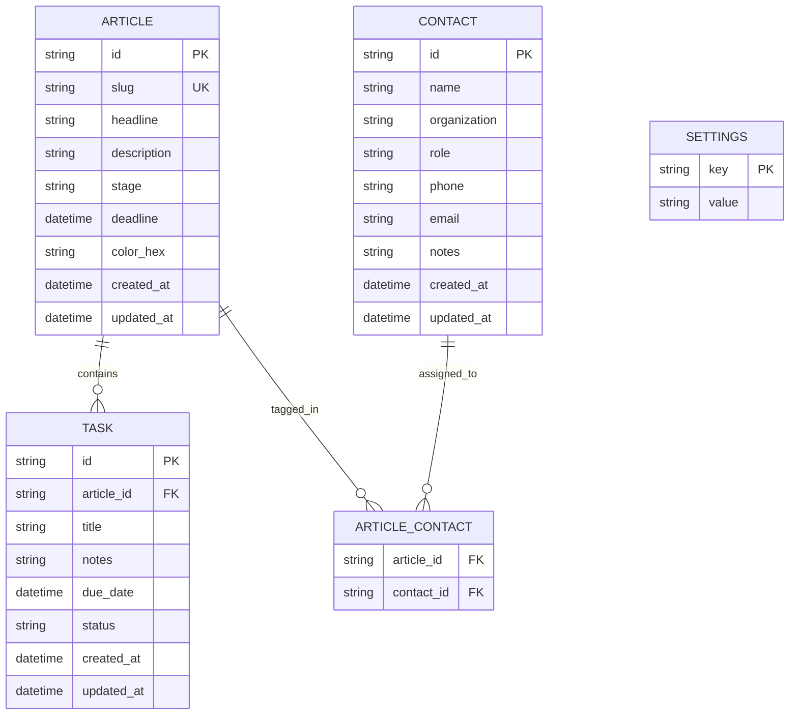

# NewsJournal: Initial Implementation Plan & Architecture Specification

NewsJournal is a pure Rust desktop application designed specifically to empower journalists to stay organized, manage multiple investigative and daily reporting workflows, track story deadlines, manage contacts, and coordinate article-linked tasks.

---

## 1. System Architecture & Key Decisions

Based on the architectural alignment and design interview:

1. **Modular Cargo Workspace**:
   - **`crates/core` (`newsjournal-core`)**: Pure Rust domain logic, data models, validation, SQLite storage (`rusqlite`), schema migrations, palette generators, overdue calculations, and state machines with comprehensive unit and integration tests.
   - **`crates/gui` (`newsjournal-gui`)**: Cross-platform desktop application using strict platform feature flags (`#[cfg(target_os = "linux")]` with `libcosmic` / COSMIC frosted glass and `#[cfg(target_os = "macos")]` with `iced` + `window_vibrancy` / macOS liquid glass).
2. **Data Storage & Persistence**:
   - Local embedded **SQLite** database managed via `rusqlite` with embedded SQL migrations.
   - Stored in standard OS data directories (`directories::ProjectDirs` or `xdg`).
3. **Glass & Visual Styling**:
   - **Linux**: COSMIC UI with `libcosmic` frosted glass container effects and dynamic COSMIC theme integration.
   - **macOS**: `iced` UI with native `window_vibrancy` liquid glass transparency effects and translucent styled glass panels.
   - **Theme Engine**: Complete support for `System` (OS-inherited), `Light`, and `Dark` modes.
4. **Interaction Paradigm**:
   - Left vertical navigation toolbar switching between Articles Kanban, Tasks Kanban, Contacts List, and Settings.
   - **Drag-and-Drop Only**: Card transitions across Kanban columns handled exclusively via mouse click-and-drag interactions.
   - **In-App Modal / Slide-over Drawer**: High-focus, layered frosted/liquid glass modal overlays for creating and editing articles, tasks, and contacts without multi-window OS tiling friction.
5. **Color & Deadline Logic**:
   - **Curated Palette Generator**: Deterministic hash-based color assignment avoiding unreadable colors (such as light yellow), with an optional custom color picker in the edit dialog.
   - **Overdue Engine**: Triggered when `current_time > deadline` and stage is not `Published`. Displays prominent red overdue alert badge and border highlights.

---

## 2. Phased Implementation Roadmap

### Phase 1: Workspace & Core Domain Architecture (`newsjournal-core`)
- [x] **1.1 Workspace Setup**: Configure root `Cargo.toml` with `crates/core` and `crates/gui` workspace members.
- [x] **1.2 Domain Models**:
  - `Article`: UUID, slug (required, unique), headline, description, stage (`Pitching`, `Researching`, `Writing`, `Editing`, `ReadyToPublish`, `Published`), deadline (datetime), color (hex/RGB), timestamps.
  - `Task`: UUID, article_id (foreign key), title, notes, due_date, status (`ToDo`, `InProgress`, `Complete`), timestamps.
  - `Contact`: UUID, name (required), organization, role, phone, email, notes, timestamps.
  - `ArticleContact`: Many-to-many join relationship between articles and contacts.
  - `Settings`: Theme mode (`System`, `Light`, `Dark`).
- [x] **1.3 Validation Engine**: Strict slug validation (URL/filesystem-safe alphanumeric with dashes/underscores), email/phone formatting, non-empty names.
- [x] **1.4 Color Palette Generator**: Hash-based deterministic assignment selecting from a high-contrast, accessible color palette (excluding low-contrast/light yellow shades) with RGB/Hex conversions.
- [x] **1.5 Overdue Engine**: Logic to evaluate deadline expiration against current timestamp, automatically excluding articles in `Published` stage.

- [x] **1.6 Core Unit & Property Tests**: TDD test suite covering validation, color generation, status transitions, and overdue calculations.

### Phase 2: Persistence Engine & Database Migrations (SQLite)
- [x] **2.1 Migration Runner**: Embedded SQL migration scripts creating tables (`articles`, `tasks`, `contacts`, `article_contacts`, `settings`) and indexes.
- [x] **2.2 Repository Layer (`StorageService`)**:
  - CRUD operations for Articles with transactional slug uniqueness guarantees.
  - CRUD operations for Tasks with parent article cascading/integrity checks.
  - CRUD operations for Contacts and tagging relationships (`link_contact_to_article`, `unlink_contact_from_article`, `list_article_contacts`).
  - Read/Write operations for application settings.
- [x] **2.3 App Directory Resolution**: Cross-platform configuration path locator using `directories` crate (`~/.local/share/newsjournal` on Linux, `~/Library/Application Support/newsjournal` on macOS).
- [x] **2.4 Integration Tests**: In-memory SQLite repository tests validating queries, joins, cascade deletions, and relational integrity.

### Phase 3: GUI Framework & Platform Glass Rendering
- [x] **3.1 GUI Crate Scaffolding**: Setup `newsjournal-gui` with shared application state, message enums, and event loops.
- [x] **3.2 Linux COSMIC Implementation (`#[cfg(target_os = "linux")]`)**:
  - Integrate `libcosmic` application wrapper.
  - Configure COSMIC frosted glass theme styling and background blur materials.
  - Setup COSMIC app icon, header bar, and window sizing.
- [x] **3.3 macOS Liquid Glass Implementation (`#[cfg(target_os = "macos")]`)**:
  - Integrate `iced` with `window_vibrancy` for macOS native window blur (`NSVisualEffectView`).
  - Implement custom iced container styles mimicking liquid glass with backdrop translucency and subtle border highlights.
- [x] **3.4 Theme Engine Integration**: Connect GUI to system theme detector, handling dynamic switching between `System`, `Light`, and `Dark`.

### Phase 4: Left Vertical Navigation Bar & Settings View
- [x] **4.1 Left Navigation Bar Component**:
  - Vertical icon + label buttons for:
    1. 📰 Articles Kanban (Main Deck)
    2. ✅ Tasks Kanban
    3. 👥 Contacts Directory
    4. ⚙️ Settings (docked at the bottom)
  - Active tab highlighting and keyboard navigation shortcuts.
- [x] **4.2 Settings Page**:
  - Theme mode selector (`System` / `Light` / `Dark`) with immediate preview.
  - Database status / path display and version information.
  - Persistence of user settings to SQLite database upon selection.

### Phase 5: Articles Kanban Board & Drag-and-Drop Interaction
- [x] **5.1 Kanban Deck Layout**: Horizontal scrollable container hosting 6 production stage columns:
  1. Pitching
  2. Researching
  3. Writing
  4. Editing
  5. Ready to Publish
  6. Published
- [x] **5.2 Article Card Component**:
  - Dynamic color-coded indicator bar/badge using the article's assigned color.
  - Display of Slug, Headline, Task completion counter (e.g. `2/5 tasks`), Contact tag pills, and Deadline badge.
  - Overdue visual state: bold red border accent and badge when `is_overdue == true`.
- [x] **5.3 Drag-and-Drop Movement Engine**:
  - Pointer click-and-drag mechanics to drag an article card from one column and drop into another.
  - Visual drag ghost and drop indicator placeholders.
  - Dispatch of stage-change update events to SQLite backend on successful drop.
- [x] **5.4 Empty State & Creation Triggers**: Column headers with card counts and "New Article" quick action button in toolbar.

### Phase 6: In-App Modal / Slide-over Drawer for Article Editing
- [x] **6.1 Glass Modal/Drawer Container**: Centered or slide-over layered glass modal with background dimming and blur.
- [x] **6.2 Article Form Fields**:
  - Required unique Slug input with live collision check.
  - Headline input and multi-line Description / Notes text area.
  - Stage selector dropdown.
  - Deadline picker (Date + optional Time selector).
  - Color picker swatch (defaults to generated hash color, allowing custom override).
- [x] **6.3 Contact Tagging Sub-Section**:
  - Searchable multi-select pill selector for existing contacts.
  - Inline "Create Contact" shortcut directly from the article form.
- [x] **6.4 Inline Task Management Sub-Section**:
  - Checklist of existing tasks for this article with status checkboxes.
  - Quick-add input field to add new tasks directly to the article.
- [ ] **6.5 Save & Cancel Actions**: Keyboard shortcuts (`Escape` to close, `Ctrl+S`/`Cmd+S` to save) and error validation tooltips.

### Phase 7: Tasks Kanban Board & Article-Task Synchronization
- [ ] **7.1 Tasks Kanban Deck Layout**: 3-column workflow board:
  1. To-Do
  2. In Progress
  3. Complete
- [ ] **7.2 Task Card Component**:
  - Left accent color strip matching the parent article's color.
  - Parent article slug badge/pill.
  - Task title, optional due date badge, and notes preview.
- [ ] **7.3 Task Drag-and-Drop Engine**: Mouse click-and-drag interaction to transition tasks between `To-Do`, `In Progress`, and `Complete`.
- [ ] **7.4 Task Creation & Editing Drawer**:
  - "New Task" button on the Tasks page with a parent article dropdown selector.
  - Click task card to open task detail/edit drawer.
  - Synchronized state updates reflecting immediately on the Article card task counters.

### Phase 8: Contacts Directory & Tagging Manager
- [ ] **8.1 Contacts List View**: Clean, searchable, and sortable list/table view showing Name, Organization, Role, Email, Phone, and tagged Articles count.
- [ ] **8.2 Contact Creation & Edit Drawer**:
  - Fields for Name (required), Organization, Role, Phone, Email, and Notes.
  - Associated articles list showing all stories where this contact is tagged.
- [ ] **8.3 Direct Creation Button**: "Add Contact" button in the top action bar of the Contacts page.
- [ ] **8.4 Contact Deletion & Unlink Safety**: Confirmations when deleting a contact that is linked to active stories.

### Phase 9: Deadline Tracking, Overdue Engine & Visual Alert System
- [ ] **9.1 Real-Time Deadline Monitor**: Background timer / tick subscription in the GUI runtime to re-evaluate overdue status every minute.
- [ ] **9.2 Overdue Visual Polish**:
  - Red accent borders and alert badges on Article cards when overdue.
  - Auto-clearing of overdue alerts when an article transitions to `Published` or when its deadline is adjusted.
  - Due soon indicators (e.g. within 24 hours warning badge).

### Phase 10: Cross-Platform Verification, Packaging & Quality Assurance
- [ ] **10.1 Verification Suite**:
  - Run `cargo fmt --all`.
  - Run strict `cargo clippy --all-targets --all-features -- -D warnings`.
  - Run `cargo nextest run --all-targets --all-features`.
- [ ] **10.2 Linux Packaging**: COSMIC desktop entry `.desktop`, icon assets, and COSMIC app packaging files.
- [ ] **10.3 macOS Packaging & Cross-Compilation**: macOS `.app` bundle structure, Info.plist, icon `.icns`, and cross-compilation validation.
- [ ] **10.4 Living Documentation Updates**: Update `README.md`, `docs/roadmap.md`, and `GEMINI.md`.

---

## 3. Data Schema & Relationships



---

## 4. Quality & Verification Gates

Per the mandatory repository standards:
- **TDD (Test-Driven Development)**: All domain functions and database queries must have unit and integration tests written first or alongside.
- **Verification Loop**:
  ```bash
  cargo fmt --all
  cargo clippy --all-targets --all-features -- -D warnings
  cargo nextest run --all-targets --all-features
  ```
- **Zero Warnings**: Strict enforcement of `-D warnings` across all compilation targets.
